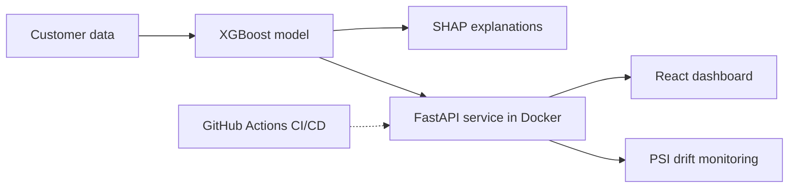
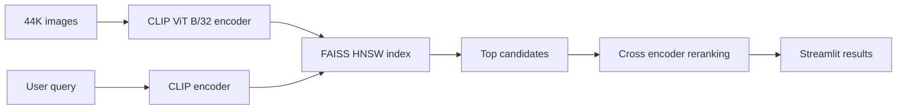

## Hi, I'm Padmapriya 👋

I'm an MS Data Science student at NYU's Center for Data Science (class of 2027), working toward machine learning engineering and data science roles. The part of ML I enjoy most comes after the notebook: getting a model served, watching it for drift, explaining its decisions, and retraining it when the data changes.

Right now I'm a Research Assistant at the NYU Infant Action Lab, where I manage a 40 year longitudinal behavioral dataset and build LLM assisted annotation workflows. Before NYU, I worked as a Data Analyst at Shri Lakshmi Narayana Industries in Chennai, after completing a BTech in Computer Science with an AI/ML specialization at SRM Institute of Science and Technology.

I'm open to ML engineering and data science opportunities. If something here interests you, I'd love to hear from you at **px451@nyu.edu**.

## Featured projects

<b>See the architecture</b>

<b>See the architecture</b>

## More on my GitHub

* [Customer Segmentation and Pricing Strategy](https://github.com/10padmapriya/Customer-Segmentation-Pricing-Strategy)
* [Social Media Analysis for Nissan Motors](https://github.com/10padmapriya/Social-media-analysis-for-Nissan-Motors)
* [LLM Models Train Themselves Using the Prompts](https://github.com/10padmapriya/LLM-Models-Train-Themselves-Using-the-Prompts)

## Toolbox

Python, XGBoost, scikit learn, FastAPI, Docker, GitHub Actions, LangGraph, FAISS, CLIP, PEFT/LoRA, Dagster, Spark, Streamlit, React

## Get in touch

📫 px451@nyu.edu | 🌐 [Portfolio](https://10padmapriya.github.io/portfolio) | 💼 [LinkedIn](YOUR_LINKEDIN_URL)
<!--
**10padmapriya/10padmapriya** is a ✨ _special_ ✨ repository because its `README.md` (this file) appears on your GitHub profile.

Here are some ideas to get you started:

- 🔭 I’m currently working on ...
- 🌱 I’m currently learning ...
- 👯 I’m looking to collaborate on ...
- 🤔 I’m looking for help with ...
- 💬 Ask me about ...
- 📫 How to reach me: ...
- 😄 Pronouns: ...
- ⚡ Fun fact: ...
-->
